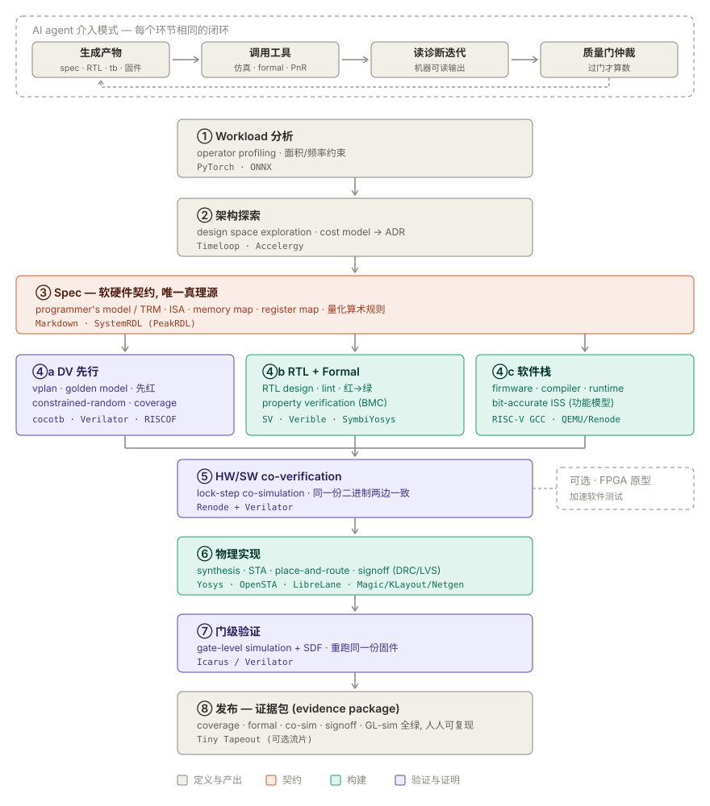

<div align="center">

# OpenChip

### A public multi-agent framework for open-source chip development

Specifications define behavior. Independent specialists own implementation and
verification. Tools and cited review bound every claim.

[](https://github.com/WJiangH/OpenChip/actions/workflows/ci.yml)
[](LICENSE)
[](AGENTS.md)

</div>

---

OpenChip provides a reusable collaboration system for chip projects:

- a shared agent constitution and nine model-independent specialist methods;
- spec authority and separate RTL/DV authorship contexts;
- one owned work item per branch and worktree;
- author-owned checks, commits, feature-branch pushes, and manifest PRs;
- independent, citation-based review with author-owned fixes;
- maintainer supervision of task decomposition, context, skills, model fit, and
  review quality;
- structured agent, account, review, and integration provenance with local
  contribution reports;
- common open-source EDA entrypoints and reference silicon artifacts.

The checked-in `blink` module validates parts of this workflow and toolchain.
It is a reference example, not proof that every planned chip or flow stage is
complete.

## Collaboration contract

The framework organizes work toward the target silicon flow below. Implemented
automation and current reference evidence are scoped in the following sections.



The spec is the source of product behavior. Architects resolve ambiguity before
implementation. RTL and DV for a module are written by different agents in
separate contexts, with DV expected values derived from the spec and independent
golden models.

The assigned specialist owns the full delivery loop: implement, run applicable
checks, commit, push the authorized feature branch, open a manifest PR, and fix
valid review findings. An independent reviewer audits role boundaries, gate
integrity, policy or spec conformance, evidence, and cross-module impact.
The manager represents the maintainer: it evaluates both the output and the
review, then adjusts assignments, skills, context, task decomposition, or model
choice when needed. It does not routinely replace the author or reviewer.

Before publication, the author audits every outgoing commit and the aggregate
diff against the intended public base. Specs, ADRs, role methods, source code,
tests, and reproducible evidence belong in public history. Personal handoffs,
conversation-derived notes, local experiment diaries, private inputs, and
local-only draft evidence do not.

Read [AGENTS.md](AGENTS.md) for the enforceable contract and
[docs/AGENTS.md](docs/AGENTS.md) for the operating model. The
[attribution protocol](docs/AGENT_ATTRIBUTION.md) separates requested runtime,
observed runtime, Git identity, platform account, and evidenced outcomes.

## What the framework automates today

The public CI workflow currently runs:

- `boundaries` on pull requests;
- `framework` regression tests on pull requests and main pushes;
- `gates` for `make lint`, `make sim`, and `make formal` on pull requests and
  main pushes.

After `framework` and `gates` pass on a main push, the same workflow archives
the exact tested Git commit and uploads its manifest and checksums. This is a
source snapshot, not a release or deployment. See [CI and source delivery](docs/CI_CD.md).

Authors and reviewers still audit publication scope and ownership; automation is
supporting evidence rather than a substitute for review. Synthesis, STA,
compliance, full-SoC simulation, GDS, and gate-level simulation are local or
milestone-specific until a public workflow runs them.

The repository exposes the same canonical role methods to supported clients:

```bash
make agents        # list detected coding-agent CLIs
make agents-sync   # mirror canonical role methods into supported CLI locations
```

These commands inventory clients and synchronize methods. Model selection and
cross-provider assignment remain orchestrator procedures. The checked-in GitHub
Agents workflow supports mentions, issue-label role dispatch, PR review, and
maintainer-authorized clean integration for its configured provider. It is not
an automatic cross-provider scheduler, and the shared role methods do not depend
on that provider.

## Public verification status

At source [`1f92f2c`](https://github.com/WJiangH/OpenChip/commit/1f92f2cfaab6163283f39018a48ce3d13e8f6795),
[CI run 34155797584](https://github.com/WJiangH/OpenChip/actions/runs/34155797584)
passed lint for both public RTL modules, 7/7 `blink` simulations, 20/20
`npu` simulations, and all 9 configured `blink` formal tasks.

| Target | Executable tests | Plan, model, and formal assets | Current boundary |
|---|---|---|---|
| `blink` | [`test_blink.py`](hw/dv/blink/test_blink.py): 7 tests, PASS | [8-row vplan](hw/dv/blink/vplan.md), [golden model](hw/dv/common/models/blink.py), [formal job](hw/formal/blink/blink.sby), [recorded evidence](evidence/blink/README.md) | Historical evidence records 100% line and toggle observations; current CI does not collect or enforce coverage |
| `npu` | [`test_npu.py`](hw/dv/npu/test_npu.py): 20 tests, PASS | [23-row vplan](hw/dv/npu/vplan.md), [golden model](hw/dv/common/models/npu.py), [bug/open-item log](hw/dv/npu/BUGS.md) | No public formal job or accepted evidence package; recorded manual toggle coverage is 38.5%, below the declared 90% target |
| SoC-1 | No public full-system testbench | [draft integration spec](docs/spec/soc_1.md) | No public integrated full-SoC or model-runtime result |

The vplan row counts are requirement mappings, not executed-test counts or a
claim of full functional coverage. See the [verification status matrix](docs/VERIFICATION_STATUS.md)
for exact scope, coverage provenance, and open items.

## Reference evidence: `blink`

The committed [`blink` evidence package](evidence/blink/README.md) records this
reference snapshot:

| Rung | Recorded result | Scope |
|---|---|---|
| Lint | PASS, 0 warnings | Verilator lint for `blink` |
| Unit simulation | PASS, 7/7 tests and 28/28 parameter-sweep runs | cocotb `blink` suite |
| Coverage observation | line 100% and toggle 100% | measured for the recorded run; automatic 90% acceptance is not wired into `make sim` |
| Formal | PASS, 10 assertions, 6 covers, 6/6 mutants caught | listed `blink` properties and parameter tasks |
| Synthesis | 106 cells, 26 flops, 0 latches | recorded Yosys result |
| Physical signoff | DRC 0, LVS match, antenna 0; timing met at 50 MHz | recorded LibreLane/sky130 result |
| Gate-level simulation | OPEN | the reference evidence does not include post-layout functional verification |

These results support the stated `blink` artifact only. The open gate-level
simulation rung is not rounded up into an end-to-end functional claim.

## Diagnostic coverage reporting

`make coverage-report` inventories one existing Verilator Coverage-3 file:

```bash
make coverage-report \
  COVERAGE_DATA=path/to/coverage.dat \
  COVERAGE_REPORT=path/to/coverage-report.json
```

The JSON includes the input SHA-256, per-kind hit and total counts, per-source
and per-hierarchy counts, and every uncovered point. Corrupt, duplicate,
missing-field, or unknown-kind records fail. The output always states that
coverage closure is false and the gate was not evaluated. See
[docs/COVERAGE_REPORT.md](docs/COVERAGE_REPORT.md).

## Tool entrypoints

```bash
make help
make lint
make sim
make formal
make synth MOD=blink
make gds MOD=blink
```

Some targets require local toolchains or milestone artifacts. A command's exit
status and output establish only the scope it actually exercises. The
[verification strategy](docs/VERIFICATION.md) separates current CI checks,
diagnostic evidence, and future acceptance rungs.

## Repository map

```text
AGENTS.md        shared policy, ownership, and publication contract
.agents/skills/  canonical model-independent role methods
docs/spec/       product specifications
docs/adr/        architecture decision records
hw/rtl/          reference RTL
hw/dv/           independent testbenches and golden models
hw/formal/       formal jobs and properties
hw/syn/          synthesis and timing inputs
hw/pd/           physical-design configuration and signoff summaries
sw/ and sim/     software and models
flow/            shared EDA make fragments, versions, and thresholds
scripts/         framework diagnostics and their tests
provenance/      verified platform mappings and public work-item evidence
evidence/        scoped, reproducible evidence packages
```

The current reference design uses a Yosys-safe SystemVerilog subset, synchronous
active-low reset, and Wishbone B4. Those are reference-design architecture
choices, not requirements imposed on every chip project that adopts the
collaboration framework.

## License

[Apache-2.0](LICENSE).
