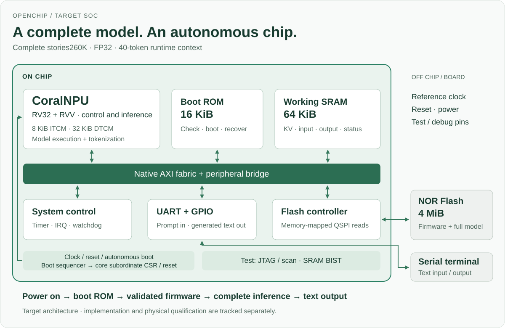

# OpenChip

OpenChip is an open framework for building silicon with collaborating engineering
agents. Our current chip direction brings **CoralNPU** into a system for complete
LLM workloads.

## Chip architecture



The selected core combines **RV32 + RVV** execution with **1 MiB instruction TCM**
and **1 MiB data TCM**. Host control and external memory are simulation adapters
today; the production SoC interfaces remain to be defined and qualified.

[Native IP](hw/ip/coralnpu/README.md) ·
[Integration contract](docs/spec/coralnpu_external_memory.md) ·
[Complete tiny-LM workload](workloads/coralnpu_llm/README.md) (draft)

Architecture, RTL, verification, software and physical design have separate
owners. An orchestrator manages the goal and dependencies; specialists deliver
through manifest pull requests, and independent reviewers check behavior,
evidence and scope before integration. The canonical [role methods](.agents/skills/)
work across coding-agent clients. Start with the [agent constitution](AGENTS.md).

## What works today

The reference `blink` and tinyNPU designs exercise lint, cocotb simulation and
selected formal jobs. Public CI also checks framework tooling and role boundaries,
and packages the exact tested source after successful main-branch runs.
[Verification](docs/VERIFICATION.md) records the tested scope, coverage denominators
and remaining gaps. These results establish neither full-SoC closure nor tapeout
readiness. Coverage reporting is diagnostic; lifecycle signoff is a manual,
independently reviewed process.

The GitHub agent workflow supports its configured provider's dispatch and review.
Methods, a [local dispatch ledger](flow/README.md#local-orchestration-ledger) and
durable state support session resumption. They do not implement a cross-provider
scheduler, enforced workspace isolation or background monitoring.

## Run the framework and reference checks

```bash
make framework-test           # Python, documentation and boundary checks
make agents                   # inspect available coding-agent clients
make agents-sync              # expose canonical skills to supported clients
make lint                     # reference RTL lint
make sim MOD=npu              # tinyNPU cocotb regression
make formal MOD=blink         # configured reference formal jobs
make help                     # other entrypoints, including unimplemented targets
```

Framework checks need Python 3.9+ and shell/Git tools. Reference hardware checks
need the pinned EDA tools and Python dependencies described in
[CI and toolchain](docs/CI_CD.md). Imported IP may retain its native build,
verification and implementation tools.

## Repository map

| Directory | Purpose | Primary owner |
|---|---|---|
| [`docs/`](docs/) | Framework guidance, specifications and architecture decisions | Orchestrator for navigation; architects and verification specialists retain contract ownership |
| [`hw/`](hw/), [`sw/`](sw/) | Reference RTL, DV, formal, implementation flows and software | Assigned RTL, verification, backend and software specialists |
| [`workloads/`](workloads/), [`explore/`](explore/) | Workload profiles and reproducible architecture cost models/results cited by specs and ADRs | Chief architect with workload specialists |
| [`flow/`](flow/) | Shared Make recipes, tool pins, policy thresholds and boundary checks used by builds and CI | Assigned framework/flow author; independent integration review |
| [`provenance/`](provenance/) | Registered account mappings and public work-item evidence used by attribution/reporting tools | Assigned framework author; independent identity/evidence review |
| [`evidence/`](evidence/) | Reproducible evidence packages for explicitly scoped engineering claims | Specialist producers; integrator assembles and audits |
| [`scripts/`](scripts/), [`tools/`](tools/) | Framework validation/reporting utilities and agent-client setup | Assigned framework/flow author |
| [`.agents/`](.agents/), [`.github/`](.github/) | Canonical role methods and repository automation | Assigned framework author; integrator reviews |

`explore/` retains engineering rationale, `provenance/` records attribution, and
`flow/` executes shared checks; all have live consumers. Private project state
and experiment receipts stay in the approved local store, outside public history.

## Direction and documentation

The [CoralNPU native IP entry](hw/ip/coralnpu/README.md) now provides pinned source
acquisition, native model generation and runtime tooling. The next engineering
steps are complete target LLM execution and SoC integration; the
[full-model contract](docs/spec/coralnpu_llm.md) remains a draft. The smaller
tinyNPU stays a fast framework regression. See the [roadmap](docs/ROADMAP.md).

- [Constitution and ownership](AGENTS.md): startup, independent roles and branch delivery.
- [Silicon lifecycle](docs/SILICON_LIFECYCLE.md): incremental, scoped signoff from feasibility through production validation.
- [Verification](docs/VERIFICATION.md): methods, public assets, recorded results and coverage diagnostics.
- [CI and toolchain](docs/CI_CD.md): actual jobs, pins and tested-source artifacts.
- [Attribution](docs/AGENT_ATTRIBUTION.md): registered identities and evidence limits.
- [Specifications](docs/spec/README.md) and [architecture decisions](docs/adr/): specialist-owned engineering contracts.

Project goals, dispatch state and private chip evidence belong in an approved
local store. Reusable [state](docs/templates/ORCHESTRATION_STATE.md) and
[signoff](docs/templates/SIGNOFF_RECORD.md) templates contain no project data.

Licensed under [Apache-2.0](LICENSE).
