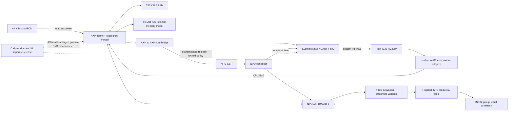

# §1 Configuration and top-level contract

Version 1.0-rc4 (change order rc4, proposal pending rc3-reviewer confirmation). Requirement IDs are immutable traceability keys. A shall applies to SIM-L1 unless marked S1 or P1. Addresses are byte addresses, ranges half-open, sizes binary. All control values and tensor bytes are little-endian.

**SYS-01:** The top shall expose `i_clk`, synchronous active-low `i_rst_n`, `o_uart_tx`, `o_cpu_trap`, `o_fatal`, `o_result_valid`, `o_result_code[31:0]`, and the external-memory AXI target-facing interface specified in axi.md. Simulation clock is 50 MHz (20 ns); this is a simulation timebase, not timing signoff. The harness shall hold reset low for at least 16 rising edges; after release the fabric/memory adapters become operational immediately and CPU reset stays asserted for four additional rising edges. No CDC, clock gating, retention or power collapse is included. An asynchronous board reset requires a separately verified wrapper at F1.

**SYS-02:** The application CPU shall implement RV32IM with 32 integer registers, no C/F/D/V extensions, no caches/MMU, reset vector 0x00000000, interrupt vector 0x00000100 and initial stack 0x10040000 (exclusive SRAM end, 16-byte aligned). Selected core is PicoRV32 native interface, with project-owned error-aware native→AXI adapter; this is not `picorv32_wb`. IRQ is PicoRV32 custom ABI, not CLINT/PLIC or a standard machine-mode trap ABI. Upstream configuration binding is in dependencies.md. Unsupported instructions, misalignment and core trap shall latch fatal and stop application progress.

**SYS-03:** Reset shall discard all command/IRQ/status state and suppress AXI VALID from DUT initiators. Reset is a coordinated system reset including the external memory protocol model, so no pre-reset response may appear in the new epoch. ROM and preloaded image/model bytes persist; mutable SRAM/external bytes need not retain meaningful data. Firmware shall initialize every mutable location before reading it, including BSS and KV. A running-command reset invalidates its entire output. There is no partial-reset cancellation in v1.

Arrows show logical transactions, not all reverse wires. contract.json provides exact endpoint roles and widths. Caliptra dashed edges are excluded from SIM-L1 elaboration; no constant-success security block is permitted.

# §2 Address, permissions and boot

| Base | Bytes | Endpoint / purpose | CPU | NPU |
|---|---:|---|---|---|
| 0x00000000 | 65536 | immutable boot ROM | R/X | deny |
| 0x10000000 | 262144 | firmware SRAM | R/W/X | deny |
| 0x40000000 | 4096 | system registers | R/W | deny |
| 0x40001000 | 4096 | NPU registers | R/W | deny |
| 0x40002000 | 4096 | IRQ registers | R/W | deny |
| 0x40003000 | 4096 | UART registers | R/W | deny |
| 0x40010000 | 65536 | reserved S1 mailbox host aperture | deny in SIM-L1 | deny |
| 0x80000000 | 1048576 | boot image + reserved padding | R | deny |
| 0x80100000 | 4194304 | model immutable bytes | R | R |
| 0x80500000 | 1048576 | KV arena | R/W | deny |
| 0x80600000 | 1048576 | NPU scratch (activation/weights/results) | R/W | R/W |
| 0x80700000 | 1048576 | independent expected checkpoint bytes | R | deny |
| 0x80800000 | 65536 | token input + result report | R/W | deny |
| 0x80810000 | 8323072 | reserved external backing bytes | deny | deny |

**SYS-04:** The fabric shall enforce the table using physical source-port identity (not writable AXI USER/PROT). Unmapped or unauthorized access returns DECERR and has no memory/peripheral side effect. A burst must fit a single authorized region. SRAM/external memory support aligned 32-bit transfers with byte strobes; the native CPU itself presents aligned words and mapped byte enables; the bridge passes the native address/data/strobes unchanged. Software unaligned half/word accesses are illegal and trap. NPU memory footprints must fit model or scratch as specified in npu.md. Expected bytes are not reachable by NPU.

**SYS-05:** ROM code shall load a 64-byte header at 0x80000000 followed by firmware bytes at 0x80000040. Header u32 words: magic 0x4C4C4D31, ABI=1, byte_length (1..0x30000), load=0x10000000, entry=0x10000000, CRC32, BSS start, BSS length; words 8..15 zero. CRC is CRC-32/ISO-HDLC: reflected polynomial 0xEDB88320, init/xorout 0xffffffff over exactly byte_length payload bytes. BSS start must be 4-aligned and >=load+length rounded to 4; its length must be multiple 4; BSS end must be <=0x10030000. All range calculations use 64-bit unsigned mathematical arithmetic and reject wraparound. ROM validates header and bounds before copy, copies via CPU AXI load/store, validates CRC over destination bytes, clears BSS, sets stack 0x10040000, writes BOOT_STAGE=2 and jumps to entry only on success. Payload source must remain within the boot image region. CRC detects accidental corruption, not authenticity.

**SYS-06:** ROM shall keep a 0x100 IRQ trampoline that forwards to 0x10000080 only after BOOT_STAGE=2; before that interrupts stay masked. Firmware entry contains a branch over the reserved IRQ vector slot. The linker shall place executable/data/BSS below 0x10030000; 0x10030000..0x10040000 is the 64 KiB downward stack. Heap allocation from the external scratch/KV arenas is explicit, not an unbounded C heap. On header, CRC or bounds failure ROM sets RESULT_CODE=0xB001, 0xB002 or 0xB003 respectively, pulses result through RESULT_COMMIT, then loops. It shall never jump on failure. Failure taxonomy (rc4): 0xB001 header covers magic, ABI, byte_length outside 1..0x30000, load or entry not equal to 0x10000000, and any nonzero word 8..15 (a nonzero reserved word is an invalid header, not don't-care); 0xB002 covers the CRC comparison only; 0xB003 bounds covers the BSS start/alignment/length/end rules, the payload-source-within-boot-image rule and any 64-bit wraparound. Checks are applied in the order header, bounds, copy, CRC, and the first failing class determines the code.

**SYS-07:** Every AXI non-OK response to a CPU request shall latch FATAL=1, FAULT_ADDR and reason=1 (read) or 2 (write) and assert local CPU reset before any further native request is accepted. The adapter must not return a successful native completion for the failed operation. This avoids assuming PicoRV32 has a standard load/store access-fault path. AXI progress timeout uses reason=3, core trap reason=4 and NPU command watchdog reason=5 and AXI protocol violation reason=6. Only the CPU core receives fatal local reset; the native bridge and fabric retain accepted AXI state and keep VALID stable until handshake or coordinated reset. Fatal is reset-only, drives o_fatal, masks new initiator issuance, and makes the run fail; it does not fabricate AXI handshakes or promise recovery without full reset.

# §3 CSR and IRQ semantics

**SYS-08:** All CSR bus transactions shall be aligned 32-bit single transfers with WSTRB=0xf on writes. Software must issue aligned word CSR loads/stores; the native CPU port does not expose original read size/byte offset, so hardware cannot distinguish a CPU LB/LH from LW of the same word. Such subword CSR reads are a software ABI violation, not a promised hardware rejection. Other sizes, strobes, offsets or writes to RO registers return SLVERR, reads return zero on error and no state changes. Undefined bits read zero; reserved write bits must be zero or the write is rejected atomically. RO means no writes, RW normal replacement, W1C clears written-one bits, WO reads return zero without side effects. Unless explicitly listed, reset is zero. If a hardware event and W1C coincide, event wins. CSR transactions never depend on a later software request to complete. WO command registers (RESULT_COMMIT, NPU SUBMIT, NPU CLEAR) accept exactly the written word value 1: any other written word, including 0, returns SLVERR and has no effect; TX_DATA accepts any word whose bits 31:8 are zero (rc4). Value ranges stated in the sys and UART register rows are hardware-enforced: a BOOT_STAGE write with value above 4 and a DIVISOR write with field value below 2 return SLVERR and change nothing; NPU descriptor shadow registers accept any word and are validated only at SUBMIT (NPU-05) (rc4).

System 0x40000000:

| Offset | Name | Access/reset | Fields / behavior |
|---|---|---|---|
| 0x00 | ID | RO / 0x4C4C4D31 | ABI family |
| 0x04 | VERSION | RO / 0x00010000 | ABI major=1 minor=0 |
| 0x08 | BOOT_STAGE | RW / 0 | 0 reset, 1 loader, 2 firmware, 3 B1, 4 L1; 0..4 only, writes above 4 return SLVERR (SYS-08) |
| 0x0c | FATAL | RO / 0 | bit0 fatal, bits15:8 reason |
| 0x10 | FAULT_ADDR | RO / 0 | first offending aligned bus word address; 0 if not address-related |
| 0x14 | RESULT_CODE | RW / 0 | zero PASS; otherwise software error code |
| 0x18 | RESULT_COMMIT | WO / 0 | write1 latches RESULT_CODE to output and sets o_result_valid until reset; a further write of 1 while o_result_valid=1 returns SLVERR and changes nothing (rc4) |
| 0x1c | CYCLE_LO | RO / 0 | reads latch current high half into CYCLE_HI shadow |
| 0x20 | CYCLE_HI | RO / 0 | latched high from most recent LO read |
| 0x24 | BUILD_CONFIG | RO / 1 | 1=SIM-L1 development boot; cannot read as secure |

**SYS-09:** The cycle counter shall increment once per i_clk rising edge after common reset release and wrap modulo 2^64; LO/HI snapshot is coherent. Fatal and result outputs remain directly observable even if CPU is halted; writing RESULT_CODE alone is not a passing run. Firmware shall not commit PASS until its selected B1/L1 checks complete. DV shall also check fabric/NPU/CPU traces, not only PASS.

IRQ 0x40002000: offset0 PENDING RO bits0 (NPU.DONE & NPU.IRQ_ENABLE[0]), 1 (NPU.ERROR & NPU.IRQ_ENABLE[1]), 2 UART.TX_EMPTY level; offset4 ENABLE RW bits2:0; offset8 ACTIVE RO=PENDING&ENABLE. PENDING therefore observes peripheral-local gated levels, not raw NPU terminal bits; raw bits remain visible in NPU.STATUS. Sources after IRQ.ENABLE gating connect to CPU irq[4], irq[5], irq[6] respectively; all other external bits zero. Internal CPU irq[0..2] remain core-owned and permanently masked through MASKED_IRQ, so illegal instructions/misalignment trigger trap rather than an application custom IRQ handler. IRQ controller has no independent pending latches or W1C; clear NPU status or refill UART to deassert sources.

**SYS-10:** CPU IRQ wrapper shall use PicoRV32 q-register ABI with ENABLE_IRQ=1, ENABLE_IRQ_QREGS=1, ENABLE_IRQ_TIMER=0 and level-sensitive external bits4..6 (LATCHED_IRQ=0x00000000, MASKED_IRQ=0xffffff8f (only4..6 unmasked)). Software shall use upstream getq/setq, maskirq, retirq sequences, preserve interrupted integer registers/stack, inspect active source registers, clear source before return and initially mask every source. Polling is permitted for L1; B1 includes an IRQ-enabled completion case. No standard mstatus/mie/mret CSR behavior is assumed.

UART 0x40003000: offset0 TX_DATA WO bits7:0; offset4 STATUS RO bit0 READY, bit1 BUSY; offset8 DIVISOR RW reset16, legal 2..65535 (writes with field value 0 or 1 return SLVERR and change nothing, SYS-08). READY=1 when one-byte holding slot empty; TX_DATA when not ready returns SLVERR (not silently dropped). Divisor writes while BUSY reject. Idle TX=1. **SYS-11:** UART shall serialize one start-zero, 8 data LSB-first and one stop-one, each DIVISOR clocks; a holding byte transfers to the shifter whenever idle, freeing the holding slot. IRQ TX_EMPTY is READY. UART is diagnostic output; no RX, receive IRQ, baud tolerance or FIFO deeper than one is promised.

# §4 Fatal event and control interfaces

**SYS-12:** Fatal producers shall expose sticky `fault_valid`, `fault_reason[2:0]`, `fault_addr[31:0]` and hold all fields until coordinated reset; no READY/backpressure exists. CPU bridge reports read/write response errors1/2 with aligned issued address, fabric reports progress3 or protocol6 with the aligned start address retained from an offered or accepted matching AR/AW when known; if no matching address was ever offered (for example an incomplete early W from an illegal initiator), fault_addr=0, NPU controller reports watchdog5 with address0, and CPU wrapper reports trap4 with address0. Earliest event sampling edge wins; simultaneous events select the lowest numeric reason. Within fabric multiple same-reason candidates select source ID0before1, then channel orderAW,W,B,AR,R. System latches cause/address once and ignores later events until common reset. Producers stop offering new transactions on their own fatal detection edge; sys drives sticky `stop_new_transactions` to CPU bridge,NPU controller,NPU DMA,fabric at the fatal capture edge. For both CPU and NPU, AXI-03 requires AW offer no later than the first W offer, so any offered W is part of an already offered write transaction. Every already offered AR/AW remains asserted, and subsequent W beats/responses for offered transactions remain permitted; stop never means retract VALID or abandon a burst. Fabric drains/routs retained work but accepts no newly offered transaction after the stop boundary; already asserted requests are explicitly retained as existing work. CPU receives `cpu_local_rst_n = rst_n & boot_delay_done & !FATAL`; the CPU wrapper receives both common rst_n and cpu_local_rst_n: its sticky fault metadata uses common rst_n, while only the PicoRV32 core uses cpu_local_rst_n. All other blocks retain common rst_n only. Bridge has no native mem_ready on a failing request, returns full unshifted RDATA only on success and independently holds its AXI state even if CPU drops mem_valid under local reset. The direct top-level o_cpu_trap mirrors CPU trap while o_fatal and latched reason persist.

**SYS-13:** The CPU native port (contract.json C01, protocol `native`) shall follow the PicoRV32 native memory interface. The core initiates a transfer by asserting mem_valid and holds mem_valid, mem_instr, mem_addr, mem_wdata and mem_wstrb stable until the rising edge on which mem_ready=1 is sampled; mem_addr is word-aligned; mem_wstrb=0 denotes a read (mem_wdata unused) and mem_wstrb!=0 a write, with only the values 0000, 1111, 1100, 0011, 1000, 0100, 0010 and 0001 possible; mem_instr=1 marks an instruction fetch and is carried as ARPROT[2] (AXI-02). The bridge shall assert mem_ready for exactly one cycle per completed transfer, never while mem_valid=0, never in the cycle in which mem_valid first rises (no combinational path from mem_valid to mem_ready), with mem_rdata valid in that cycle for reads and unused for writes; a failing request receives no mem_ready (SYS-07). The bridge shall not require mem_valid to deassert between transfers: mem_valid=1 in any cycle after a mem_ready cycle is a new transfer, and at most one transfer is live (AXI-04). DV may read `hw/ip/picorv32/README.md` at the pinned commit (dependencies.md) sections "PicoRV32 Native Memory Interface" and "Custom Instructions for IRQ Handling" as the normative description of the integrated core's external behaviour; `picorv32.v` remains implementation and is not a DV input.
